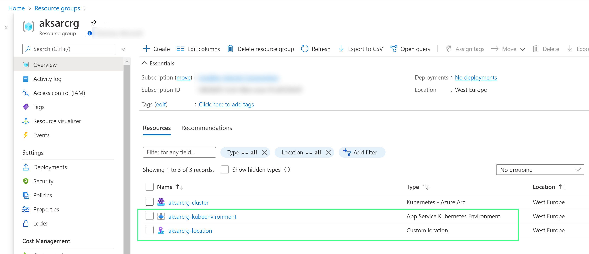
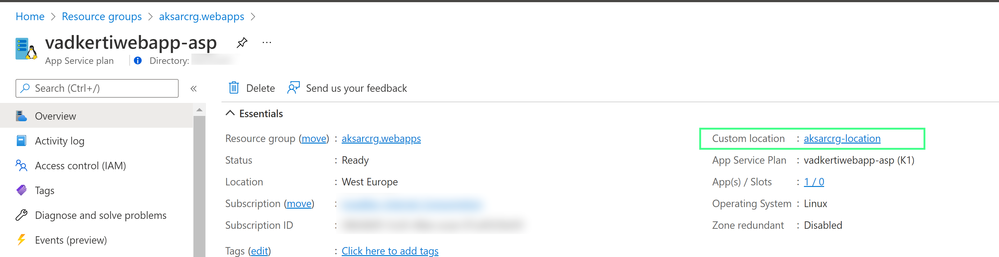
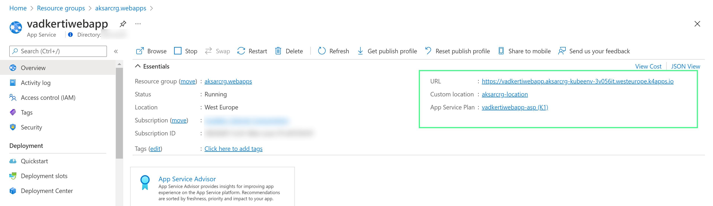

# Introduction
Deployment of Azure Arc App Service Extensions on AKS clusters with the help of Az CLI scripts and ARM templates.
After setting up this environment you can easily place you Azure App Services (Web Apps, Logic Apps, Functions, EventGrid, API Management) on your AKS or ARO cluster. Azure Arc App Service Extension also supports deploying these workloads (Azure App Service and Data Service) to any K8S clusters deployed to on-premises or to other cloud service providers. 
More information about Azure Arc is available:
https://docs.microsoft.com/en-us/azure/azure-arc/kubernetes/overview

Azure Arc App Service extension exposes his services through custom locations similar to Azure Regions:


App service plan runs in that location:


Web App deployed on this App Service Plan:


---
> [!TIP]
> Scripts are only for demonstrating purposes.


# Getting Started

## **1. Installation process**

- Use the bash scripts available under the folder 'iac' to deploy your AKS cluster and Azure Arc App Service extension in your own subscription. 
    - [deployaks.sh](./iac/deployaks.sh) deploys an AAD-enabled AKS cluster, whereas 
    - [deployaro.sh](./iac/deployaro.sh) deploys an Azure Redhat OpenShift (ARO) cluster.
    - [appserviceextension.sh] (./iac/appserviceextension.sh) create AzureArc resource and deploy app service extension on your cluster
- AAD group is required to deploy the clusters, see bash variable "aadAdminGroupId="xxxxxxxxxxxxxxxxxxx"
- Every bash script expects parameters (details found in the scripts)

## **2. Software dependencies**

- Not applicable

# Build and Test
Azure YAML pipelines are available under the folder '.pipelines':
- [aks-iac-pipeline.yml](./iac/aks-iac-pipeline.yml) to deploy an AKS cluster
- [aro-iac-pipeline.yml](./iac/aro-iac-pipeline.yml) to deploy an ARO cluster
- [arcattachappext-existing-pipeline.yml](./iac/arcattachappext-existing-pipeline.yml) to connect Arc to an existing K8S cluster and to set up app service extensions
- [createappserviceonaks-pipeline.yml](./iac/createappserviceonaks-pipeline.yml) to DEPLOY A WEB APP on K8S through ARM template

## 1. Use **deployaks.sh** or **deployaro.sh** from your pipelines to deploy the AKS cluster:
```bash 
echo "change chmod to be executable"
sudo chmod +x $(Build.SourcesDirectory)/iac/deployaks.sh
# Fails the AzureCLI task if the below deployment script fails   
set -e
$(Build.SourcesDirectory)/deployment/deployaks.sh $(location) $(resourcegroup) $(clustername) $(acrname)
```

## 2. Set up Azure Arc with App Service Extension ([appserviceextension.sh](./iac/appserviceextension.sh))
```bash
set -e
echo "change chmod to be executable"
sudo chmod +x $(Build.SourcesDirectory)/iac/appserviceextension.sh
echo "Service principal id: $servicePrincipalId"
spnobjectid=$(az ad sp show --id $servicePrincipalId --query objectId -o tsv)
echo "SPN Object Id: $spnobjectid"
$(Build.SourcesDirectory)/iac/appserviceextension.sh $(location) $(resourcegroup) $(clustername) $(arcname) $(arcResourceGroup) $spnobjectid
```

## 3. Deploy Web App on your cluster ([appservicearmtemplate](./iac/appservicearmtemplate.json))
```bash
set -e
az group create -n $(resourcegroup) --location $(location)
az deployment group create -g $(resourcegroup)  --template-file $(Build.SourcesDirectory)/iac/appservicearmtemplate.json -p name=$(appname) \
     -p kubeEnvironmentId=$(kubeenvironmentId) \
     -p customLocationId=$(customlocationId) --debug
```


# Contribute
Please feel free to reuse these samples. If you think, there are better approaches to accomplish these jobs, please share with us.
